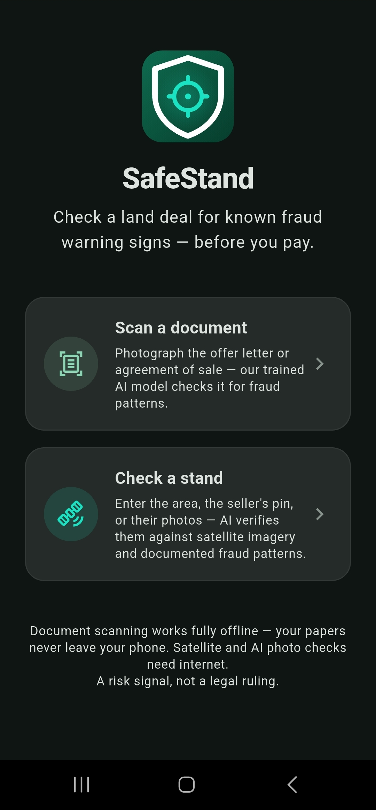
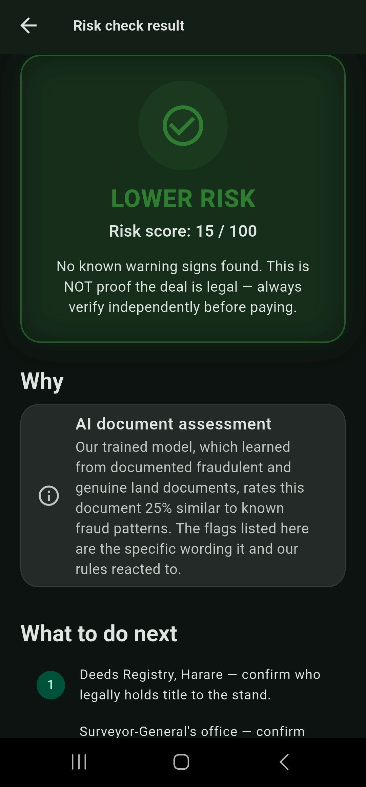
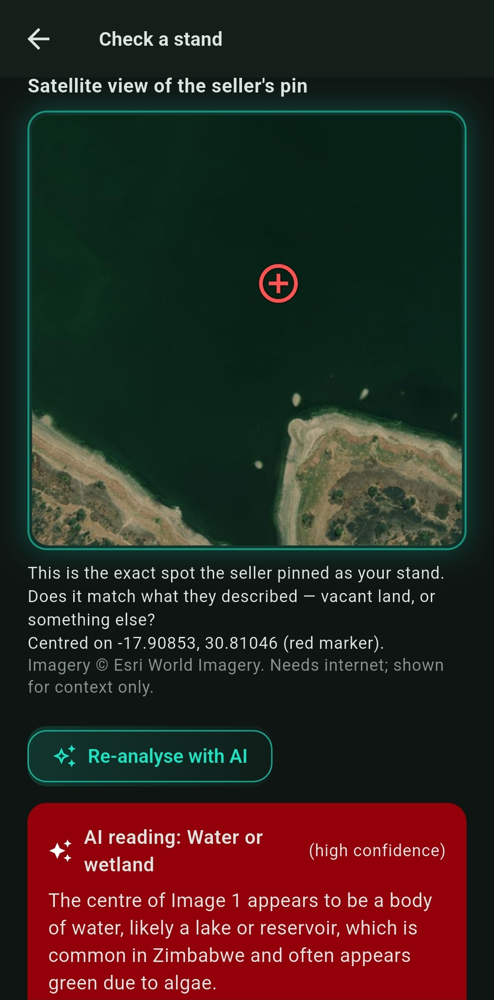

# SafeStand

**An early-warning app that helps Zimbabwean home-seekers spot risky land deals
before they pay — document scanning works fully offline.**

Submitted to the POTRAZ *AI for Impact Challenge 2026* — Development Track.

---

## Problem

Thousands of Zimbabwean families lose their life savings, and later their homes, to
land barons who sell stands they have no legal right to sell. Buyers are handed
"offer letters" from unregistered cooperatives, pay in cash, build — and are later
declared illegal occupants when bulldozers arrive. Government inquiries (e.g. the
Uchena Commission) documented widespread illegal sales of state and council land,
yet buyers are usually the ones left homeless. **Diaspora buyers are the most
exposed**: they pay thousands of dollars remotely for land they have never seen,
based on WhatsApp photos from the seller.

The standard advice ("verify at the district office, engage a conveyancer, check
the deeds registry") is correct but slow, manual, and usually discovered too late.

## Solution

SafeStand is a **risk-triage tool, not a legal-verification service** — it cannot
declare a stand legally clean (there is no public queryable land registry), but it
flags risk in seconds and routes the buyer to the right authority *before* money
changes hands. Two flows:

1. **Scan a document** *(fully offline)* — photograph the offer letter / agreement
   of sale. On-device OCR extracts the text; **our trained fraud classifier** scores
   it; the rule engine explains exactly which wording raised or lowered the risk
   (missing council reference, no Surveyor-General diagram, "regularise later"
   language, cash-only payment, imitation stamps…).
2. **Check a stand** *(for buyers who can't visit — the diaspora flow)* — enter the
   claimed area, paste the seller's location pin, add the seller's photos. The app
   checks the area against documented fraud cases, the pin against a wetland
   database and live satellite imagery, photo EXIF metadata against the claimed
   location, and runs **two independent AI analyses** (satellite land-class and
   photo content/authenticity) which it then **cross-examines deterministically**.

Every verdict is a **Green / Amber / Red** score with plain-language, source-cited
reasons and concrete next steps (Deeds Registry, Surveyor-General, Registrar of
Cooperative Societies, EMA).

## Demo

- **Video walkthrough:** [youtube.com/shorts/8ZsRPSG9iZY](https://youtube.com/shorts/8ZsRPSG9iZY) — both flows on a live device.
- Run locally: see **Setup** below (Android device recommended — the OCR needs a camera).
- Test documents: [`test_docs/`](../test_docs/) contains 10 fictitious specimen PDFs
  (5 genuine-style, 5 fraud-style, all with synthetic stamps) for exercising the scan flow.
- Satellite/wetland demo pins: `-17.795, 31.010` (inside Monavale Vlei — instant
  offline wetland flag) and any Lake Chivero water coordinate (online AI reads
  water/wetland).
- Screenshots: [`docs/screenshots/`](docs/screenshots/) — full walkthrough set.

| Home | Scan verdict | Satellite + AI |
|---|---|---|
|  |  |  |

## Architecture

See [docs/architecture.md](docs/architecture.md) for the diagram and data-flow notes.

Summary: Flutter app, no backend server in v1. Three AI components — Google ML Kit
OCR (on-device), **our trained TF-IDF + logistic-regression fraud classifier**
(pure-Dart inference, ~50 KB, on-device, offline), and a Groq-hosted vision model
(online, optional) — grounded by four bundled databases (documented fraud cases,
red-flag rules, gazetteer, wetlands) and deterministic geometry/cross-check logic.

## Data

All bundled data is **synthetic or compiled from cited public sources** — no real
personal data anywhere. Details, provenance and limitations:
[docs/data_and_ai_note.md](docs/data_and_ai_note.md). The ML training pipeline,
data contract and honest evaluation story live in [`ml/`](ml/README.md).

## AI Method

Three models, each justified against a non-AI baseline, each validated, each
overseeable — plus two things that are deliberately **not** AI (the wetland
database lookup and the cross-examination logic), because you don't guess at
answers you can cite. Full note: [docs/data_and_ai_note.md](docs/data_and_ai_note.md).

Headline validation: the trained classifier scores **17/17 on real-style held-out
specimens it never trained on**, reproduced identically by the Dart port in CI
(`test/fraud_classifier_test.dart`), and the trainer refuses to export a model that
drops below 100% on that set.

## Setup

Prerequisites: Flutter ≥ 3.5, an Android device or emulator (API 24+).

```bash
cd safestand
flutter pub get
flutter test                                   # 51 tests should pass
flutter run --dart-define=GROQ_API_KEY=...     # key optional; see below
```

Without a key the app runs fully with all offline features; the two online AI
analyses show an honest "not configured in this build" note instead.

## Environment Variables

| Variable | Purpose | Required? |
|---|---|---|
| `GROQ_API_KEY` | Vision AI (satellite land-class + photo authenticity), passed via `--dart-define` at build time | No — offline features work without it |

No `.env` file exists at runtime; see [.env.example](.env.example) for documentation.
Keys are never committed and are rotated before public release builds.

## Tests

```bash
flutter test          # full suite: 51 tests
flutter analyze       # zero issues expected
```

Coverage summary and what each suite guards: [docs/testing_evidence.md](docs/testing_evidence.md).
Retraining the classifier (no Python needed): `dart run tool/train_model.dart` —
it re-augments, retrains, re-evaluates against the sacred held-out set, and refuses
to export on any regression.

## Deployment

Mobile-first, offline-first, no server in v1 (nothing to host, nothing to breach).
Full plan — operator, pilot sites, support, monitoring, scale pathway:
[docs/deployment_plan.md](docs/deployment_plan.md). Business model:
[docs/business_model.md](docs/business_model.md).

## Known Limitations

Stated honestly, because the app's whole brand is honesty:

- **Not legal verification.** A Green verdict means "no known warning signs," never
  "this deal is safe." Stated in-app on every result.
- **OCR quality bounds the scan flow** — poor lighting/cameras degrade text
  extraction; the UI shows extracted text so users can judge the read quality.
- **The classifier is trained on synthetic data** (real specimens held out for
  evaluation only). It is designed for a drop-in retrain when the real POTRAZ
  dataset arrives — a retrain, not a rebuild (`ml/DATA_CONTRACT.md`).
- **Wetland boundaries are indicative circles** compiled from public documentation,
  not EMA shapefiles; every wetland flag tells the user to verify with EMA.
- **The vision AI reads single-date RGB imagery** — a dry-season vlei can pass for
  grass; mitigated by the offline wetland layer, vlei-indicator prompting, and a
  planned seasonal classifier (`ml/README.md`, Phase 3).
- **Seller photos without metadata are common** (WhatsApp strips EXIF); mitigated by
  the AI photo-content analysis, which judges pixels rather than metadata.
- **Android only** in v1; gazetteer/wetland coverage is greater-Harare-first.

## Team

| Member | Role |
|---|---|
| **Jimiel Chifamba** | Team Lead — originator of the idea; design & development |
| **Mthusi Mudau** | Design & development |

## Status

Working MVP built for the AI for Impact Challenge 2026: two AI-led flows, 51 passing
tests, structured commit history. Pilot plan: diaspora community groups (primary) +
a Harare residents association — see the deployment plan.
