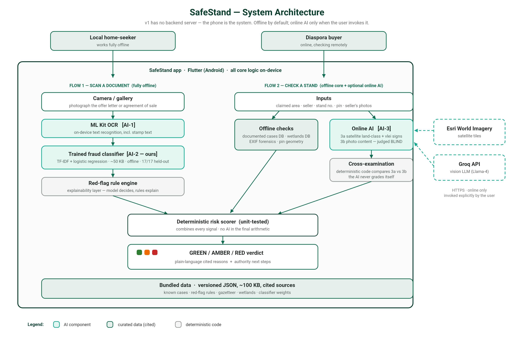

# SafeStand — Architecture

No backend server exists in v1: the phone **is** the system. This is a deliberate
choice — offline capability for at-risk local buyers, zero hosting cost, and the
strongest possible privacy posture (no server-side user data exists).

## Diagram



Regenerate after architecture changes:
`flutter test test/tools/diagram_generator_test.dart`

### Text version

```
                                USERS
   Local home-seeker (offline-capable)      Diaspora buyer (online)
              │                                      │
              ▼                                      ▼
┌─────────────────────────────────────────────────────────────────────┐
│                    FLUTTER APP (Android, v1)                        │
│                                                                     │
│  FLOW 1: Scan a document              FLOW 2: Check a stand         │
│  ┌───────────────────────┐            ┌──────────────────────────┐  │
│  │ Camera / gallery       │           │ Area + seller + stand no. │ │
│  │   ↓                    │           │ Seller's location pin     │ │
│  │ ML Kit OCR  [AI-1]     │           │ Seller's photos           │ │
│  │  on-device, offline    │           │   ↓            ↓          │ │
│  │   ↓                    │           │ EXIF GPS/time  Pin parse  │ │
│  │ Fraud classifier [AI-2]│           │ (forensics)   (geometry)  │ │
│  │  OUR trained model     │           │        ↓                  │ │
│  │  pure Dart, offline    │           │ Online (optional):        │ │
│  │   ↓                    │           │  Satellite tiles ─────────┼─┼── Esri World
│  │ Rule engine            │           │  Vision AI [AI-3a]: land  │ │   Imagery API
│  │  (explainability)      │           │  Vision AI [AI-3b]: photo ┼─┼── Groq API
│  └──────────┬─────────────┘           │  BLIND + cross-examined   │ │  (key via
│             │                         └────────────┬──────────────┘ │  --dart-define)
│             ▼                                      ▼                │
│  ┌────────────────────────────────────────────────────────────┐    │
│  │              RISK SCORER (deterministic, tested)           │    │
│  │  combines: model score · rule flags · documented-area hits │    │
│  │  · wetland hits · geometry contradictions · AI cross-check │    │
│  └────────────────────────────┬───────────────────────────────┘    │
│                               ▼                                    │
│        GREEN / AMBER / RED verdict + cited reasons + next steps    │
│                                                                     │
│  BUNDLED DATA (versioned JSON assets, all cited/synthetic):        │
│   known_cases · red_flag_rules · gazetteer · wetlands ·            │
│   model_export (trained classifier weights)                        │
└─────────────────────────────────────────────────────────────────────┘
              │ (only when user runs online AI; images sent
              ▼  at point of use, stated in-app)
     External: Esri tile API (imagery) · Groq API (vision LLM)
```

## Component notes

| Component | Choice | Why |
|---|---|---|
| Frontend | Flutter (Android first) | Single codebase, offline-capable, strong camera/ML Kit support, iOS later |
| Backend | **None in v1** | Nothing to host/breach; all logic on-device. Phase 2 (moderated crowd-reports) adds a small cloud function + DB |
| Database | Versioned JSON assets bundled in the APK | Data is small (~100 KB total), read-only, offline, updated via app releases; auditable in git |
| AI-1: OCR | Google ML Kit text recognition | On-device, offline, free; reads documents and stamp text |
| AI-2: Fraud classifier | TF-IDF + logistic regression, trained by us, exported to JSON, pure-Dart inference | ~50 KB, offline, milliseconds per inference, fully explainable per-term; validated 17/17 on held-out real-style specimens |
| AI-3: Vision LLM | Llama-4-Scout via Groq API | Judges satellite land class + photo authenticity; online-only and optional by design |
| Cross-examination | Deterministic Dart (not AI) | The two vision analyses run blind to each other; app code compares their terrain classes — auditable, testable |
| Auth | None in v1 | No accounts, no personal data collected — data-minimisation by architecture |
| Monitoring | Play Console crash reporting + in-app feedback (pilot) | Proportionate to a no-backend v1 |
| Secrets | `--dart-define` at build time | Never committed; `.env.example` documents the one key |

## Data flow & privacy

- Documents/photos are processed on-device. They leave the phone **only** when the
  user explicitly taps the online AI analysis, which the UI states at the point of use.
- No user account, no server-side storage, no analytics SDK in v1.
- Every outbound call: Esri (tile fetch by coordinate) and Groq (images + prompt).

## Integration readiness (ToR 7.3)

- **Consumes APIs**: Esri World Imagery (documented tile scheme), Groq
  chat-completions (OpenAI-compatible; documented in `lib/services/land_context_service.dart`).
- **Data import**: datasets are contract-defined CSV/JSON (`ml/DATA_CONTRACT.md`) —
  the real POTRAZ dataset drops in as a retrain, not a rebuild.
- **Data export**: verdicts are shareable by the user; a PDF "risk report" export is
  a planned phase-2 feature for conveyancers/banks.
- **Institutional integration targets**: EMA wetland shapefiles (replaces indicative
  circles with zero code change), Deeds Registry / Registrar workflows (phase 3).
